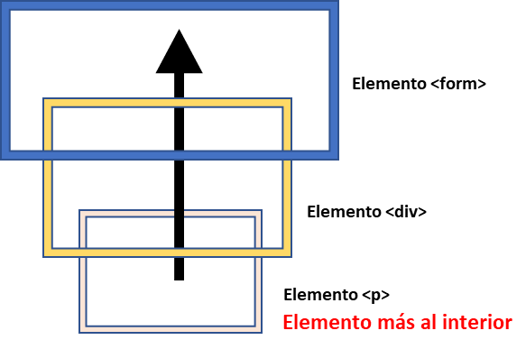

# EventosJS
## Ejemplo de eventos en JS

### ¿Qué es un evento en JS?

>
> En evento es un indicativo o señal de que algo ha ocurrido. Todos los nodos del DOM generan esta señales.
> 
>>**DOM** es la abreviatura de **D**ocument **O**bject **M**odel
>> 
>> El **DOM** es la estructura de objetos que genera el navegador cuando se carga un documento y se puede alterar mediante Javascript
>> para cambiar dinámicamente los contenidos y aspecto de la página.
>
 
   - #### Lista de eventos más representativos del DOM

      - #### Eventos de mouse 🖱️

            click                - cuando se hace click con el mouse o se hace touch sobre un elemento.
            contextmenu          - cuando se hace click derecho con el mouse sobre un elemento.
            mouseover / mouseout - cuando el puntero del mouse ingresa / abandona un elemento.
            mousedown / mouseup  - cuando el botón del mouse es presionado / soltado sobre un elemento.
            mousemove            - cuando el mouse se mueve.

      - #### Eventos de teclado ⌨️
            keydown / keyup  - al presionar / soltar una tecla.

      - #### Eventos de elemento form ⏏️
            submit - cuando el usaurio envía un <form>.
            focus  - cuando el usuario se centra sobre un elemento.

      - #### Eventos de documento 📋
            DOMContentLoaded - cuando el HTML es cargado y procesado, el DOM está completamente construido.

      - #### Eventos de CSS :
            transitionend - cuando una animación CSS concluye.

- ### preventDefault
      Previene que la acción por defecto asociada o las funciones incorporados en el elemento del DOM se
      ejecuten.
      Es una función dentro dentro de un objeto y no funciona sin su evento.
      
- ### stopPropagation
      Evita que se realize la propagación de los eventos/funciones hacia los ancentros del elemento,en 
      otras palabras, se detiene el efecto burbuja, pero todos los eventos/funciones en el elemento actual
      se ejecutarán.
      
- ### Propagación de eventos
  **Principio de Propagación**
      
      Cuando un evento ocurre en un elemento, este primero ejecuta los eventos/funciones que tiene asignados,
      luego los eventos/funciones del padre, y así hasta otros ancestros.
      
      Así si hacemos click en 
, entonces, veremos 3 eventos: p → div → form.

      Este proceso se conoce como “propagación” porque los eventos “se propagan” desde el elemento más al
      interior a través de los padres, como una burbuja en el agua.
      
- ### Fases de los eventos

### Event Emitter y eventos en NodeJS
* sapo
